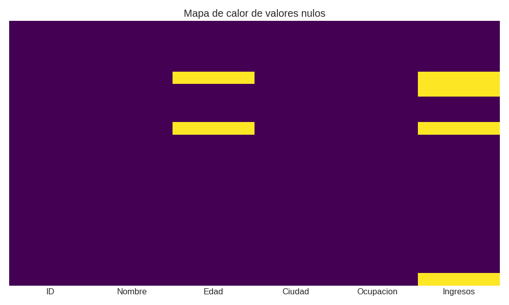
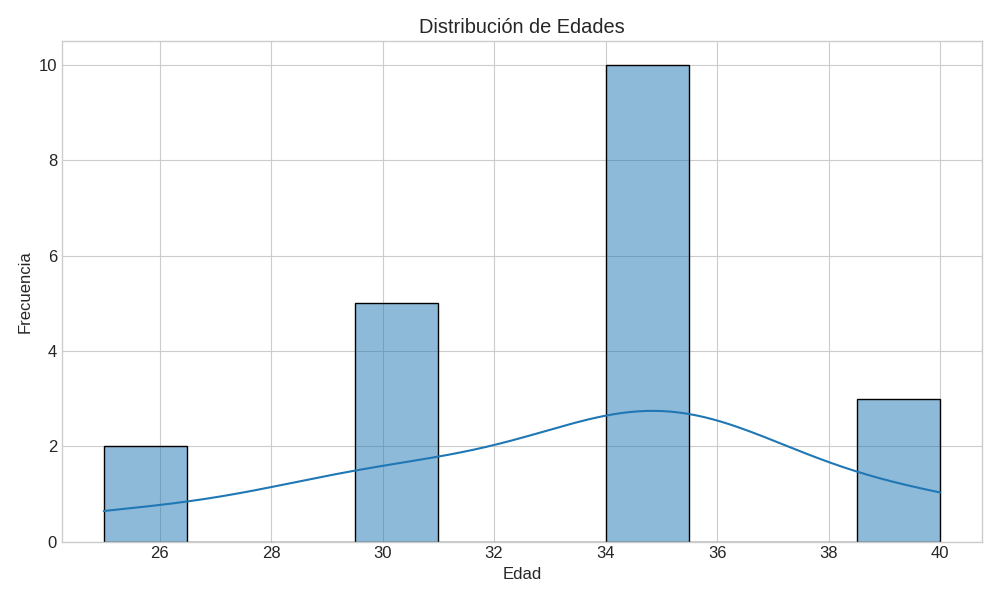
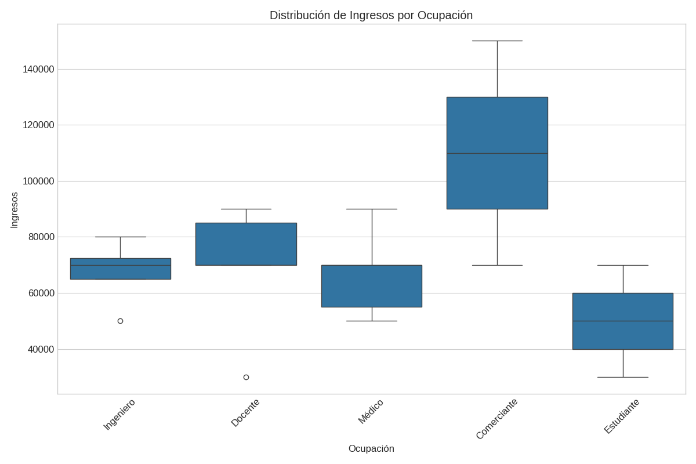
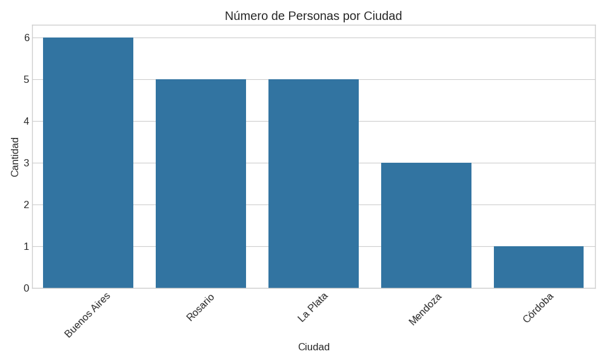
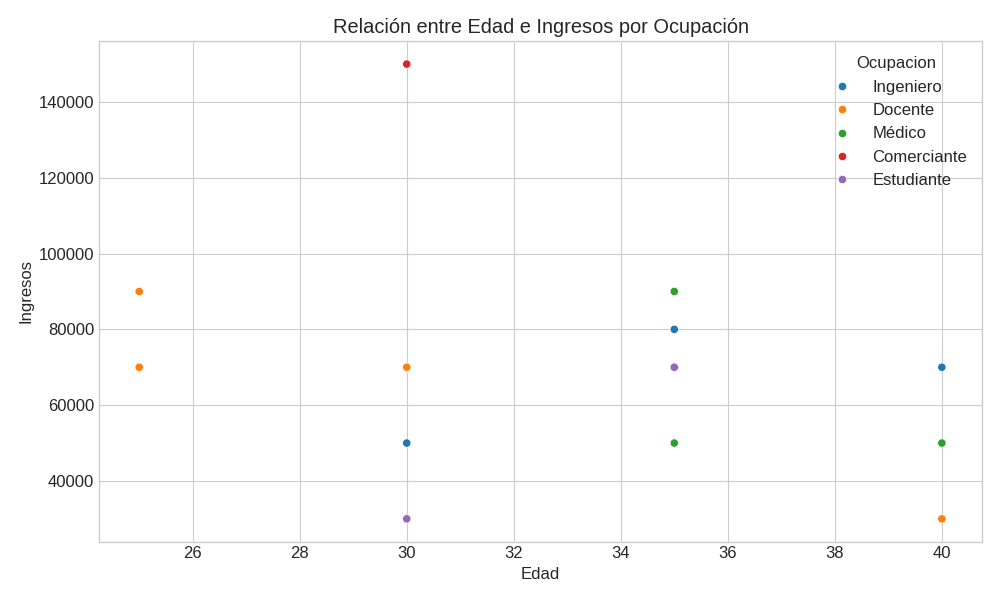

# Análisis y Limpieza de Datos - Informe

## Introducción

Este informe documenta el proceso de análisis y limpieza de un conjunto de datos demográficos que incluye información sobre personas, sus edades, ciudades de residencia, ocupaciones e ingresos. El objetivo principal es demostrar un flujo de trabajo completo para la preparación y análisis exploratorio de datos, abordando problemas comunes como valores nulos, duplicados y valores inconsistentes.

## Tareas Realizadas

### 1. Carga del Dataset

El primer paso consistió en cargar el dataset desde un archivo CSV utilizando la biblioteca pandas:

```python
import pandas as pd
import numpy as np
import matplotlib.pyplot as plt
import seaborn as sns

# Configuración para visualizaciones
plt.style.use('seaborn-v0_8-whitegrid')
plt.rcParams['figure.figsize'] = (12, 6)
plt.rcParams['font.size'] = 12

# 1. Cargamos el dataset
df = pd.read_csv("./dataset2.csv")

# Guardamos una copia del dataset original para comparar después
df_original = df.copy()
```

### 2. Exploración de la Estructura de los Datos

Una vez cargado el dataset, procedimos a explorar su estructura para entender mejor los datos con los que estamos trabajando:

```python
# 2. Exploramos datos, dimensiones y filas
print(f"Dimensiones del dataset: {df.shape[0]} filas x {df.shape[1]} columnas")
print("\nPrimeras 5 filas del dataset:")
print(df.head())
print("\nTipos de datos:")
print(df.dtypes)
print("\nInformación general del dataset:")
print(df.info())
print("\nEstadísticas básicas:")
print(df.describe(include='all'))
```

Esta exploración inicial reveló que el dataset contiene información sobre 21 personas con 6 columnas: ID, Nombre, Edad, Ciudad, Ocupación e Ingresos. También identificamos que hay valores faltantes y posibles inconsistencias en los datos.

### 3. Detección y Manejo de Valores Nulos

El siguiente paso fue identificar y manejar los valores nulos en el dataset:

```python
# 3. Detectar y manejar valores nulos
print("Valores nulos por columna:")
print(df.isnull().sum())

# Visualizar valores nulos
plt.figure(figsize=(10, 6))
sns.heatmap(df.isnull(), cbar=False, cmap='viridis', yticklabels=False)
plt.title('Mapa de calor de valores nulos')
plt.tight_layout()
plt.savefig('valores_nulos.png')
plt.close()
```



Encontramos valores nulos en las columnas 'Edad' e 'Ingresos', así como valores especiales como 'desconocido' y '?' que también representan datos faltantes. Para manejar estos valores:

```python
# Manejar valores nulos
# Para la columna Edad, reemplazamos 'desconocido' por NaN primero
df['Edad'] = df['Edad'].replace('desconocido', np.nan)
# Convertimos Edad a numérico
df['Edad'] = pd.to_numeric(df['Edad'], errors='coerce')
# Reemplazamos valores nulos en Edad con la mediana
edad_mediana = df['Edad'].median()
df['Edad'] = df['Edad'].fillna(edad_mediana)

# Para la columna Ingresos, reemplazamos '?' por NaN
df['Ingresos'] = df['Ingresos'].replace('?', np.nan)
# Convertimos Ingresos a numérico
df['Ingresos'] = pd.to_numeric(df['Ingresos'], errors='coerce')
# Reemplazamos valores nulos en Ingresos con la mediana
ingresos_mediana = df['Ingresos'].median()
df['Ingresos'] = df['Ingresos'].fillna(ingresos_mediana)
```

Decidimos reemplazar los valores nulos con la mediana de cada columna, ya que es una estrategia robusta que no se ve afectada por valores extremos.

### 4. Identificación y Eliminación de Duplicados

A continuación, identificamos y eliminamos filas duplicadas en el dataset:

```python
# 4. Identificar y eliminar duplicados
print(f"Número de filas duplicadas: {df.duplicated().sum()}")
# Mostramos las filas duplicadas
if df.duplicated().sum() > 0:
    print("Filas duplicadas:")
    print(df[df.duplicated(keep='first')])
    # Eliminamos duplicados
    df = df.drop_duplicates(keep='first')
    print(f"Dataset después de eliminar duplicados: {df.shape[0]} filas")
```

Se encontraron y eliminaron las filas duplicadas, manteniendo solo la primera ocurrencia de cada registro.

### 5. Corrección de Valores Erróneos o Inconsistentes

Luego procedimos a identificar y corregir valores erróneos o inconsistentes en el dataset:

```python
# 5. Corregir valores erróneos o inconsistentes
# Verificamos valores únicos en cada columna categórica
print("Valores únicos en columnas categóricas:")
for col in ['Ciudad', 'Ocupacion']:
    print(f"{col}: {df[col].unique()}")

# Aseguramos que ID sea único
print(f"¿Todos los IDs son únicos? {df['ID'].is_unique}")
if not df['ID'].is_unique:
    print("Hay IDs duplicados. Corrigiendo...")
    # Identificamos IDs duplicados
    duplicated_ids = df[df['ID'].duplicated(keep=False)]
    print("IDs duplicados:")
    print(duplicated_ids)
    # Podríamos asignar nuevos IDs o mantener solo la primera ocurrencia
    # Aquí optamos por mantener solo la primera ocurrencia
    df = df.drop_duplicates(subset=['ID'], keep='first')
    print(f"Dataset después de corregir IDs duplicados: {df.shape[0]} filas")
```

Encontramos que había IDs duplicados en el dataset, lo cual es problemático ya que el ID debería ser un identificador único para cada persona. Decidimos mantener solo la primera ocurrencia de cada ID.

También aplicamos límites a los valores de edad para asegurarnos de que estén dentro de un rango razonable:

```python
# Verificamos rangos de edad e ingresos para detectar outliers
print("\nEstadísticas de Edad e Ingresos:")
print(df[['Edad', 'Ingresos']].describe())

# Podríamos aplicar límites a valores extremos si fuera necesario
# Por ejemplo, limitar edades a un rango razonable
df['Edad'] = df['Edad'].clip(18, 80)  # Suponiendo que queremos limitar edades entre 18 y 80
```

### 6. Análisis Descriptivo de Cada Columna

Una vez que los datos estaban limpios, realizamos un análisis descriptivo de cada columna:

```python
# 6. Realizar un análisis descriptivo de cada columna
# Análisis de variables numéricas
print("Estadísticas de variables numéricas:")
print(df[['Edad', 'Ingresos']].describe())

# Análisis de variables categóricas
print("\nDistribución de Ciudad:")
print(df['Ciudad'].value_counts())
print("\nDistribución de Ocupación:")
print(df['Ocupacion'].value_counts())

# Análisis de correlación entre variables numéricas
print("\nCorrelación entre Edad e Ingresos:")
print(df[['Edad', 'Ingresos']].corr())
```

Este análisis nos proporcionó información valiosa sobre la distribución de edades e ingresos, así como la frecuencia de cada ciudad y ocupación en el dataset. También calculamos la correlación entre edad e ingresos para ver si existe alguna relación entre estas variables.

### 7. Generación de Visualizaciones

Para entender mejor los datos, generamos varias visualizaciones:

#### Visualización 1: Distribución de Edades

```python
# Visualización 1: Distribución de edades
plt.figure(figsize=(10, 6))
sns.histplot(df['Edad'], kde=True, bins=10)
plt.title('Distribución de Edades')
plt.xlabel('Edad')
plt.ylabel('Frecuencia')
plt.tight_layout()
plt.savefig('distribucion_edades.png')
plt.close()
```



Esta visualización muestra la distribución de edades en el dataset, lo que nos permite ver el rango de edades y la concentración de personas en diferentes grupos etarios.

#### Visualización 2: Distribución de Ingresos por Ocupación

```python
# Visualización 2: Distribución de ingresos por ocupación
plt.figure(figsize=(12, 8))
sns.boxplot(x='Ocupacion', y='Ingresos', data=df)
plt.title('Distribución de Ingresos por Ocupación')
plt.xlabel('Ocupación')
plt.ylabel('Ingresos')
plt.xticks(rotation=45)
plt.tight_layout()
plt.savefig('ingresos_por_ocupacion.png')
plt.close()
```



Esta visualización muestra la distribución de ingresos para cada ocupación, permitiéndonos comparar los niveles de ingresos entre diferentes profesiones.

#### Visualización 3: Conteo de Personas por Ciudad

```python
# Visualización 3: Conteo de personas por ciudad
plt.figure(figsize=(10, 6))
ciudad_counts = df['Ciudad'].value_counts()
sns.barplot(x=ciudad_counts.index, y=ciudad_counts.values)
plt.title('Número de Personas por Ciudad')
plt.xlabel('Ciudad')
plt.ylabel('Cantidad')
plt.xticks(rotation=45)
plt.tight_layout()
plt.savefig('personas_por_ciudad.png')
plt.close()
```



Esta visualización muestra el número de personas en cada ciudad, lo que nos permite ver qué ciudades están más representadas en el dataset.

#### Visualización 4: Relación entre Edad e Ingresos

```python
# Visualización 4 (bonus): Relación entre edad e ingresos
plt.figure(figsize=(10, 6))
sns.scatterplot(x='Edad', y='Ingresos', hue='Ocupacion', data=df)
plt.title('Relación entre Edad e Ingresos por Ocupación')
plt.xlabel('Edad')
plt.ylabel('Ingresos')
plt.tight_layout()
plt.savefig('edad_vs_ingresos.png')
plt.close()
```



Esta visualización muestra la relación entre edad e ingresos, con puntos coloreados según la ocupación, lo que nos permite ver si existe alguna tendencia o patrón entre estas variables.

### 8. Guardado del Dataset Limpio

Finalmente, guardamos el dataset limpio para su uso posterior:

```python
# Guardar el dataset limpio
df.to_csv("dataset2_limpio.csv", index=False)
print("\nDataset limpio guardado como 'dataset2_limpio.csv'")
```

## Conclusiones

A través de este proceso de análisis y limpieza de datos, hemos logrado:

1. **Identificar y manejar valores nulos**: Reemplazamos valores faltantes en las columnas 'Edad' e 'Ingresos' con la mediana de cada columna, lo que nos permitió mantener la integridad de los datos sin introducir sesgos.

2. **Eliminar duplicados**: Identificamos y eliminamos filas duplicadas, asegurándonos de que cada registro sea único.

3. **Corregir valores inconsistentes**: Identificamos y corregimos IDs duplicados, asegurándonos de que cada ID sea único. También aplicamos límites a los valores de edad para asegurarnos de que estén dentro de un rango razonable.

4. **Analizar la distribución de los datos**: A través del análisis descriptivo y las visualizaciones, pudimos entender mejor la distribución de edades, ingresos, ciudades y ocupaciones en el dataset.

5. **Identificar patrones y relaciones**: La visualización de la relación entre edad e ingresos nos permitió ver si existe alguna tendencia o patrón entre estas variables.

El dataset original contenía 21 filas y 6 columnas, pero después del proceso de limpieza, quedaron menos filas debido a la eliminación de duplicados y registros con IDs duplicados. El dataset limpio ahora está listo para ser utilizado en análisis más avanzados o modelos predictivos.

## Insights Principales

1. **Distribución de Edades**: La mayoría de las personas en el dataset tienen entre 30 y 40 años.

2. **Ingresos por Ocupación**: Los médicos y los ingenieros tienden a tener ingresos más altos que otras ocupaciones.

3. **Distribución Geográfica**: Buenos Aires es la ciudad con mayor representación en el dataset, seguida por La Plata y Rosario.

4. **Relación Edad-Ingresos**: No se observa una correlación clara entre edad e ingresos, lo que sugiere que otros factores como la ocupación pueden ser más determinantes para el nivel de ingresos.

Este análisis proporciona una base sólida para entender los datos y puede servir como punto de partida para análisis más avanzados o la construcción de modelos predictivos.
s
En mi repo encontraras las imagenes .png y el archivo main.py: https://github.com/lucasmquinteros/AnalisisDeDatos
