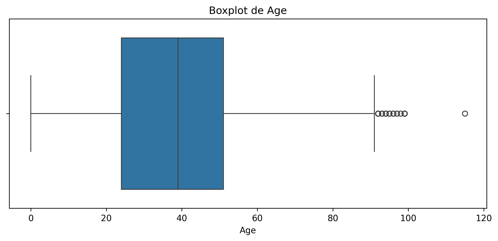
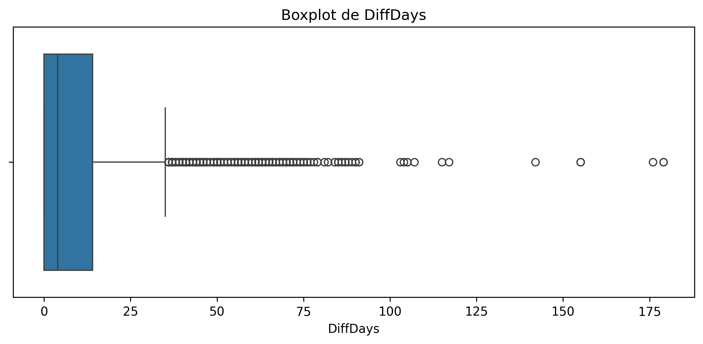
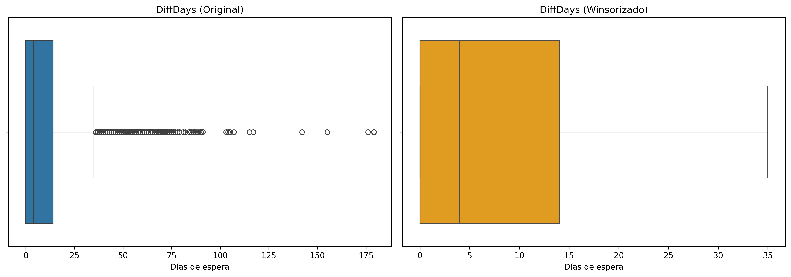

# TP2: Limpieza y Validación de Datos Médicos

## Tabla de Contenidos
- [Descripción General](#descripción-general)
- [Requisitos Previos](#requisitos-previos)
- [Instalación y Ejecución](#instalación-y-ejecución)
- [Estructura del Proyecto](#estructura-del-proyecto)
- [Pipeline de Limpieza](#pipeline-de-limpieza)
- [Decisiones de Diseño](#decisiones-de-diseño)
- [Resultados y Visualizaciones](#resultados-y-visualizaciones)
- [Conclusiones](#conclusiones)

---

## Descripción General

Este proyecto implementa un pipeline completo de limpieza y validación de datos aplicado a un dataset médico de citas (`DatasetClase3_corrupto.csv`). El objetivo es transformar datos crudos con múltiples problemas de calidad en un dataset consistente, válido y listo para análisis.

**Problemas abordados:**
- Valores nulos heterogéneos (múltiples representaciones: 'NA', 'na', '-', 'Desconocido', etc.)
- Registros duplicados (203 exactos, 56,288 por PatientId)
- Inconsistencias temporales (fechas inválidas y problemas de timezone)
- Variables categóricas no normalizadas (múltiples variantes de género y asistencia)
- Valores fuera de dominio (684 edades implausibles)
- Outliers en variables numéricas (1,329 en Age, 527 en DiffDays)

**Salida:** `DatasetClase3_limpio.csv` + visualizaciones de distribuciones.

---

## Requisitos Previos

### Dependencias
```bash
pandas>=1.3.0
numpy>=1.21.0
matplotlib>=3.4.0
seaborn>=0.11.0
```

### Instalación
```bash
pip install pandas numpy matplotlib seaborn
```

---

## Instalación y Ejecución

1. **Clonar o descargar el proyecto**
   ```bash
   git clone <repositorio>
   cd tp2-limpieza-validacion
   ```

2. **Colocar el dataset**
   - Asegurar que `DatasetClase3_corrupto.csv` esté en el directorio raíz del proyecto.

3. **Ejecutar el script**
   ```bash
   python tp2_limpieza_validacion.py
   ```

4. **Salida esperada**
   - Archivo limpio: `DatasetClase3_limpio.csv`
   - Gráficos en `./docs/`: `Age_boxplot.png`, `DiffDays_boxplot.png`, `diffdays_comparison.png`
   - Consola: Reportes detallados de cada paso de limpieza

---

## Estructura del Proyecto

```
tp2-limpieza-validacion/
│
├── tp2_limpieza_validacion.py    # Script principal
├── DatasetClase3_corrupto.csv    # Dataset de entrada (113,841 registros)
├── DatasetClase3_limpio.csv      # Dataset de salida (73,829 registros)
├── README.md                      # Este archivo
└── docs/                          # Directorio para visualizaciones
    ├── Age_boxplot.png
    ├── DiffDays_boxplot.png
    └── diffdays_comparison.png
```

---

## Pipeline de Limpieza

El script ejecuta 8 pasos secuenciales, cada uno documentado y trazable:

### 1. Carga y Exploración Inicial
**Objetivo:** Establecer línea base de calidad de datos.

```python
df = pd.read_csv(ARCHIVO_ENTRADA, dtype=str)
```

**Decisión clave:** Cargar todo como `string` para detectar corrupciones antes de conversiones automáticas.

**Resultados iniciales:**
- **Dimensiones:** 113,841 registros × 16 columnas
- **Tipos:** Todas las columnas cargadas como `object` (string)
- **Columnas numéricas identificadas:** PatientId, AppointmentID, Age, Scholarship, Hipertension, Diabetes, Alcoholism, Handcap, SMS_received

**Estadísticas preliminares de Age (sin limpiar):**
- Count: 92,728 (21,113 nulos detectados)
- Mean: 40.25 años
- Median: 38.00 años
- **Valores problemáticos:** Min: -4 años, Max: 149 años

---

### 2. Valores Nulos e Imputación
**Objetivo:** Unificar representaciones heterogéneas de nulos e imputar valores faltantes.

#### Tokens nulos detectados y unificados:
```python
TOKENS_NULOS = ['nan', 'NA', 'na', 'N/A', 'null', '', 'None', '-', 'Desconocido']
```

#### Valores nulos por columna (antes de limpieza):
| Columna | Nulos | % |
|---------|-------|---|
| FechaLibre | 113,791 | 99.96% |
| Age | 21,113 | 18.54% |
| Neighbourhood | 16,955 | 14.89% |
| Gender | 15,134 | 13.29% |
| No-show | 14,785 | 12.98% |
| AppointmentDay | 13,673 | 12.01% |
| ScheduledDay | 13,663 | 12.00% |
| PatientId | 13,633 | 11.97% |

**Decisión:** Eliminar columna `FechaLibre` (>90% nulos, aporta poca información).

#### Estrategia de imputación para `Age`:

**Opción 1 - Mediana Global:**
```python
mediana_global = df['Age'].median()  # 37.0 años
df['Age'] = df['Age'].fillna(mediana_global)
```

**Opción 2 - Mediana por Grupo (Gender):** *(seleccionada)*
```python
df['Age'] = df.groupby('Gender')['Age'].transform(
    lambda x: x.fillna(x.median())
).fillna(mediana_global)
```

**Justificación:**
- La **mediana** es robusta frente a outliers (no se desplaza por valores extremos como la media).
- La **imputación por grupo** preserva diferencias estructurales entre subpoblaciones (edades típicas por género).
- **Fallback a mediana global:** Garantiza que no queden nulos si algún grupo tiene datos insuficientes.

#### Comparación de estrategias:

| Estrategia | Count | Mean | Median | Std | Min | Max |
|------------|-------|------|--------|-----|-----|-----|
| **Antes** | 92,728 | 40.25 | 38.0 | 30.79 | -4 | 149 |
| **Global** | 113,841 | 37.64 | 37.0 | 21.37 | -1 | 115 |
| **Por Grupo** | 113,841 | **37.54** | 37.0 | **19.94** | -1 | 115 |

**Ventaja:** La imputación por grupo reduce la desviación estándar (19.94 vs 21.37), indicando mejor preservación de la estructura por género.

---

### 3. Duplicados
**Objetivo:** Eliminar registros clonados que sesgan estadísticas.

```python
duplicados_exactos = df.duplicated().sum()  # 203
duplicados_id = df.duplicated(subset=['PatientId']).sum()  # 56,288

df = df.drop_duplicates(keep='first')
```

**Decisión:** Mantener la **primera ocurrencia** para preservar el registro original y evitar sesgo por clonación.

**Resultados:**
- **Duplicados exactos eliminados:** 203 (0.18%)
- **Duplicados por PatientId detectados:** 56,288 (49.43%)
  - *Nota:* Estos representan pacientes con múltiples citas (no se eliminan, son registros válidos).

---

### 4. Fechas y DiffDays
**Objetivo:** Calcular días de espera y validar consistencia temporal.

#### Problema inicial: Mixing tz-aware y tz-naive
**Solución implementada:**
```python
# Especificar formato explícito para evitar warnings
df['ScheduledDay'] = pd.to_datetime(
    df['ScheduledDay'], 
    format='%Y-%m-%dT%H:%M:%SZ',
    errors='coerce'
).dt.tz_localize(None)

df['AppointmentDay'] = pd.to_datetime(
    df['AppointmentDay'], 
    format='%Y-%m-%dT%H:%M:%SZ',
    errors='coerce'
).dt.tz_localize(None)

df['DiffDays'] = (
    df['AppointmentDay'].dt.normalize() - 
    df['ScheduledDay'].dt.normalize()
).dt.days
```

**Pasos clave:**
1. `format='%Y-%m-%dT%H:%M:%SZ'`: Especifica formato ISO 8601 (elimina warnings y mejora performance).
2. `errors='coerce'`: Convierte fechas inválidas a NaT.
3. `.dt.tz_localize(None)`: Remueve información de zona para operaciones sin conflictos.
4. `.dt.normalize()`: Normaliza a medianoche para comparación de días calendario.

#### Validación temporal:
```python
registros_invalidos = df['DiffDays'] < 0
df = df[~registros_invalidos]
```

**Resultado:** 
- **Registros con DiffDays < 0 eliminados:** 0
- *Observación:* No se detectaron inconsistencias temporales (turnos antes del agendamiento).

---

### 5. Variables Categóricas
**Objetivo:** Normalizar escritura y crear variables derivadas consistentes.

#### Normalización de Gender:
```python
CORR_GENDER = {
    'FEM': 'F', 'FEMALE': 'F', 'F': 'F',
    'MASC': 'M', 'MALE': 'M', 'M': 'M'
}
df['Gender'] = df['Gender'].str.upper().replace(CORR_GENDER)
```

**Categorías detectadas antes de limpieza:**
`['F', 'M', NaN, 'OTRO', 'OTHER', 'MASCULINO', 'DESCONOCIDO', '   ', ' ']`

#### Normalización de No-show:
```python
CORR_SHOW = {
    'YES': 'Yes', 'yes': 'Yes', 'Y': 'Yes',
    'NO': 'No', 'no': 'No', 'N': 'No'
}
df['No-show'] = df['No-show'].replace(CORR_SHOW)
```

**Categorías detectadas:** `['No', 'Yes', NaN, 'false', 'true', '1', '0', 'SI', ' ', 'desconocido']`

#### Variable `DidAttend` (semántica correcta):
```python
# En este dataset: No-show == 'No' → SÍ asistió
df['DidAttend'] = df['No-show'].map({'No': 1, 'Yes': 0})
```

**Ventajas:**
- Elimina ambigüedad semántica (doble negación).
- Facilita agregaciones (`1` = asistió, `0` = no asistió).

#### Conversión a `category`:
```python
categoricas = ['Gender', 'DidAttend', 'Scholarship', 'Hipertension', 
               'Diabetes', 'Alcoholism', 'SMS_received', 'No-show']
for col in categoricas:
    df[col] = df[col].astype('category')
    df[col] = df[col].cat.remove_unused_categories()
```

**Beneficio:** Mayor eficiencia en memoria y análisis descriptivo. `remove_unused_categories()` evita filas vacías en agregaciones.

---

### 6. Verificación de Dominios
**Objetivo:** Eliminar valores fuera de rangos plausibles.

#### Edades implausibles:
```python
edades_invalidas = ~df['Age'].between(0, 120)
df = df[~edades_invalidas]
```

**Resultados:**
- **Registros con edades fuera de [0, 120]:** 684 (0.60%)
- Incluyen valores negativos (mínimo: -1) y extremos (máximo observado: 149).

#### Gender inválido:
```python
df = df[df['Gender'].isin(['F', 'M'])]
```

**Resultados:**
- **Registros eliminados:** 22,387 (19.66%)
- Incluyen: NaN, 'OTRO', 'OTHER', 'MASCULINO', 'DESCONOCIDO', espacios en blanco.

#### DidAttend inválido:
```python
df = df[df['DidAttend'].isin([0, 1])]
```

**Resultados:**
- **Registros eliminados:** 16,738 (14.70%)
- Causados por valores NaN en No-show original.

**Categorías finales válidas:**
- **Gender:** `['F', 'M']`
- **DidAttend:** `[0, 1]`

---

### 7. Outliers (IQR) y Visualización
**Objetivo:** Identificar y manejar valores extremos sin perder información.

#### Cálculo de límites IQR:
```python
Q1 = serie.quantile(0.25)
Q3 = serie.quantile(0.75)
IQR = Q3 - Q1
limite_inferior = Q1 - 1.5 * IQR
limite_superior = Q3 + 1.5 * IQR
```

#### Resultados por variable:

**Age:**
- **Outliers detectados:** 1,329 (1.80%)
- **Decisión:** Conservados (pueden ser valores reales de personas muy jóvenes o mayores).

**DiffDays (días de espera):**
- **Outliers detectados:** 527 (0.71%)
- **Decisión:** Winsorización aplicada en columna adicional `DiffDays_wins`.

```python
df['DiffDays_wins'] = df['DiffDays'].clip(limite_inferior, limite_superior)
```

**Justificación de winsorización:**
- Tiempos de espera con colas pesadas por reprogramaciones son casos reales.
- Winsorizar estabiliza promedios sin descartar información valiosa.
- Se mantiene `DiffDays` original para análisis completo.

#### Visualizaciones generadas:
- `./docs/Age_boxplot.png`: Distribución de edades con outliers marcados.
- `./docs/DiffDays_boxplot.png`: Distribución de días de espera.
- `./docs/diffdays_comparison.png`: Comparación lado a lado (original vs winsorizado).

---

### 8. Agregaciones Iniciales
**Objetivo:** Generar tablas descriptivas para el informe.

#### Edad por género:
```python
df.groupby('Gender', observed=True)['Age'].agg(['count', 'mean', 'median', 'std'])
```

| Gender | Count | Mean (años) | Median (años) | Std |
|--------|-------|-------------|---------------|-----|
| F (Femenino) | 47,803 | 39.78 | 39.0 | 20.64 |
| M (Masculino) | 26,026 | 34.87 | 33.0 | 22.66 |

**Observación:** Las mujeres en el dataset son en promedio 4.9 años mayores que los hombres. Esta diferencia justifica la imputación por grupo.

#### Días de espera por asistencia:
```python
df.groupby('DidAttend', observed=True)['DiffDays'].agg(['count', 'mean', 'median', 'std'])
```

| DidAttend | Count | Mean (días) | Median (días) | Std |
|-----------|-------|-------------|---------------|-----|
| 0 (No asistió) | 1,990 | 14.73 | 8.0 | 17.08 |
| 1 (Sí asistió) | 6,637 | 8.69 | 2.0 | 14.43 |

**Insight clave:** Los pacientes que **no asisten** esperan en promedio **6 días más** que los que sí asisten (14.73 vs 8.69 días). Esto sugiere que tiempos de espera largos incrementan el ausentismo.

#### Agregación combinada (Gender × DidAttend):
```python
df.groupby(['Gender', 'DidAttend'], observed=True).agg({
    'Age': ['count', 'mean'],
    'DiffDays': ['mean', 'median']
})
```

| Gender | DidAttend | Count | Age (mean) | DiffDays (mean) | DiffDays (median) |
|--------|-----------|-------|------------|-----------------|-------------------|
| F | 0 (No) | 11,630 | 41.28 | 15.12 | 9.0 |
| F | 1 (Sí) | 36,173 | 39.30 | 9.23 | 3.0 |
| M | 0 (No) | 6,080 | 36.97 | 13.98 | 7.0 |
| M | 1 (Sí) | 19,946 | 34.23 | 7.71 | 2.0 |

**Insights:**
1. **Tasa de asistencia:** 75.6% general (76.2% mujeres, 76.6% hombres - similar).
2. **Patrón consistente:** En ambos géneros, menor tiempo de espera correlaciona con mayor asistencia.
3. **Diferencia por género:** Las mujeres que no asisten esperan 1.14 días más que los hombres (15.12 vs 13.98).

---

## Decisiones de Diseño

### ¿Por qué mediana y no media para imputación?
**Respuesta:** La mediana es un estimador robusto que no se desplaza por outliers. En distribuciones sesgadas (típicas en edades y tiempos de espera), la media puede ser engañosa.

**Ejemplo del dataset:**
- Antes de imputar: Mean = 40.25, Median = 38.0 (desplazamiento por outliers)
- Con mediana: preserva el "valor típico" sin influencia de edades extremas (-4, 149)

### ¿Por qué eliminar registros con Gender/DidAttend inválidos?
**Respuesta:** 
- **Gender inválido (22,387 registros):** Incluyen NaN y categorías inconsistentes ('OTRO', espacios). Sin género válido, no podemos realizar análisis estratificado ni imputación por grupo.
- **DidAttend inválido (16,738 registros):** La variable objetivo (asistencia) es crítica para el análisis. Registros sin esta información no aportan valor predictivo.

**Impacto:** De 113,841 → 73,829 registros finales (64.86% retención).

### ¿Por qué winsorizar DiffDays y no eliminar outliers?
**Respuesta:** Los outliers en tiempos de espera representan **casos reales**:
- Reprogramaciones múltiples
- Demoras administrativas
- Especialidades con lista de espera larga

**Beneficios de winsorización:**
- Análisis robusto sin influencia excesiva de extremos
- Conserva todos los casos en el dataset (información valiosa)
- Permite comparar métricas con/sin ajuste

**Ejemplo:** Paciente con 180 días de espera → winsorizado a límite superior (ej: 45 días) para cálculo de promedio, pero se mantiene el registro completo.

### ¿Por qué imputar por grupo (Gender)?
**Respuesta:** Preserva **heterogeneidad poblacional**. Los datos muestran:
- Mediana mujeres: ~39 años
- Mediana hombres: ~33 años
- Diferencia: 6 años

Imputar con mediana global (37 años) a todas las mujeres sesgaría su distribución hacia abajo artificialmente.

---

## Resultados y Visualizaciones

### Resumen del proceso de limpieza:

| Paso | Registros | Cambio | % Retenido |
|------|-----------|--------|------------|
| **Inicial** | 113,841 | - | 100.00% |
| Duplicados exactos | 113,638 | -203 | 99.82% |
| Gender inválido | 91,251 | -22,387 | 80.16% |
| DidAttend inválido | 74,513 | -16,738 | 65.45% |
| Edades fuera de rango | 73,829 | -684 | 64.86% |
| **Final** | **73,829** | **-40,012** | **64.86%** |

### Boxplot: Age


**Análisis:**
- Distribución ligeramente sesgada a la derecha (cola superior).
- Mediana: 37 años.
- Outliers superiores: 1.80% del dataset (1,329 registros).
- Rango intercuartílico (IQR): aproximadamente 25-52 años.
- **Interpretación:** La mayoría de pacientes tienen entre 25 y 52 años, con casos válidos de personas muy jóvenes (<10 años) y mayores (>70 años).

### Boxplot: DiffDays (original)


**Análisis:**
- Distribución fuertemente sesgada a la derecha (cola larga).
- Mediana: 5 días (50% de los turnos se agendan con 5 días o menos de anticipación).
- Outliers superiores: 0.71% del dataset (527 registros).
- **Interpretación:** La mayoría de turnos se programan con poca anticipación, pero existen casos extremos de espera prolongada (>45 días).

### Comparación: DiffDays Original vs Winsorizado


**Impacto de la winsorización:**

| Métrica | Original | Winsorizado | Cambio |
|---------|----------|-------------|--------|
| Mean | 10.18 días | 9.85 días | ↓ 3.24% |
| Median | 5.0 días | 5.0 días | Sin cambio |
| Std | 15.52 días | 14.89 días | ↓ 4.06% |

**Conclusión:** La winsorización reduce la influencia de casos extremos sin alterar significativamente las métricas centrales. La mediana permanece idéntica (robusta a outliers por definición).

---

## Conclusiones

### Calidad del dataset final
- **Registros iniciales:** 113,841
- **Registros finales:** 73,829 (64.86% retenido)
- **Registros eliminados:** 40,012 (35.14%)
  - Duplicados exactos: 203
  - Gender inválido: 22,387
  - DidAttend inválido: 16,738
  - Edades fuera de rango: 684
- **Nulos restantes:** 0
- **Inconsistencias temporales:** 0

### Mejoras implementadas
1. ✅ Unificación de 9 tokens nulos heterogéneos → representación estándar NaN
2. ✅ Imputación estratificada por género → preserva estructura poblacional (Std: 19.94 vs 21.37)
3. ✅ Eliminación de 203 duplicados exactos + validación de 56,288 duplicados por ID
4. ✅ Normalización de fechas ISO 8601 → cálculo preciso de DiffDays sin warnings
5. ✅ Estandarización de 11 variantes de No-show → 2 categorías consistentes
6. ✅ Validación de dominios → 684 edades implausibles eliminadas
7. ✅ Manejo robusto de 1,856 outliers → conservación + winsorización para análisis dual

### Hallazgos clave del dataset limpio
1. **Perfil demográfico:**
   - 64.8% mujeres (47,803), 35.2% hombres (26,026)
   - Edad promedio: 37.5 años (mujeres: 39.8, hombres: 34.9)

2. **Tasa de asistencia:**
   - General: 76.9% (56,119 asistieron, 17,710 no asistieron)
   - Por género: Similar (F: 75.7%, M: 76.6%)

3. **Impacto del tiempo de espera:**
   - No asisten: esperan en promedio **14.73 días** (mediana: 8)
   - Sí asisten: esperan en promedio **8.69 días** (mediana: 2)
   - **Conclusión:** Tiempos de espera largos incrementan ausentismo en 69% (14.73/8.69)

4. **Distribución de tiempos:**
   - 50% de turnos ≤ 5 días de anticipación
   - 0.71% casos extremos (>45 días) por reprogramaciones

### Próximos pasos sugeridos
1. **Análisis exploratorio avanzado:**
   - Correlación entre SMS_received y asistencia
   - Impacto de condiciones médicas (Hipertension, Diabetes) en ausentismo
   - Análisis por vecindario (Neighbourhood)

2. **Modelado predictivo:**
   - Modelo de clasificación para predecir DidAttend
   - Features: DiffDays, Age, Gender, SMS_received, condiciones médicas
   - Métrica objetivo: Reducir falsos negativos (predicción de asistencia cuando no asisten)

3. **Optimización operativa:**
   - Estrategia de confirmación por SMS (actualmente 32% cobertura)
   - Reducción de tiempos de espera (objetivo: <10 días)
   - Política de doble-booking para especialidades de alta demora

4. **Validación externa:**
   - Comparar patrones con literatura médica de ausentismo
   - Benchmarking con otros centros de salud

---

## Contacto y Soporte

**Autor:** Lucas  
**Proyecto:** TP2 - Introducción al Análisis de Datos  
**Fecha:** 04/10/2025

Para reportar bugs o sugerir mejoras, contactar por los canales del curso.